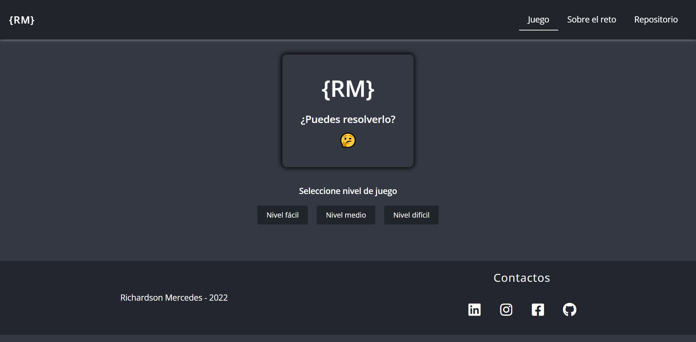
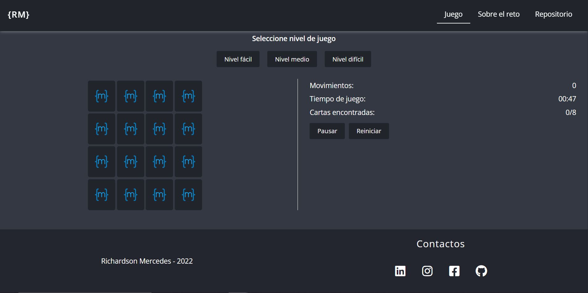
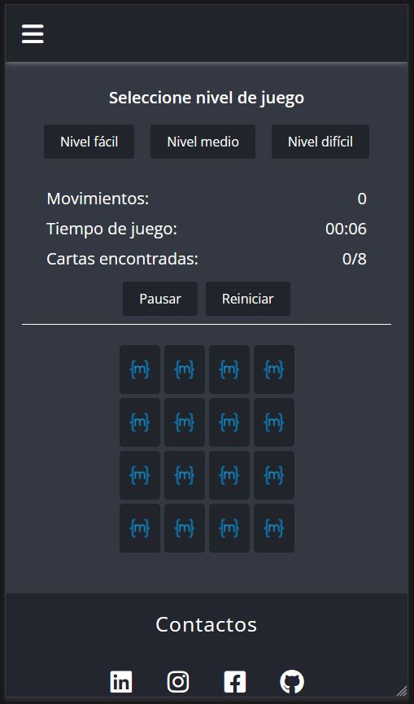

# Memory game

  <h2>Solución para el desafío de <a href="https://go.rviewer.io/dev-memory-game-es/">MoureDev & rviewer</a></h2>
  
  <h3>
    <a href="https://richardson-05.github.io/memory_game/">Probar juego</a>
     | 
    <a href="https://github.com/richardson-05/memory_game">Código fuente</a>
  </h3>

 

# Tecnologías utilizadas

  
  
  

 

# Vista previa
<h3>Pantala inicial</h3>

<h3>Adaptable</h3>

  

  

# Contact
- LinkedIn [Richardson Mercedes](https://www.linkedin.com/in/richardson-mercedes-ab84241ab/)
- GitHub [@richardson-05](https://github.com/richardson-05)
- Twitter [@RichardsonMerc2](https://twitter.com/RichardsonMerc2)
- Instagram [@_richardson_mercedes_](https://www.instagram.com/_richardson_mercedes_/)
